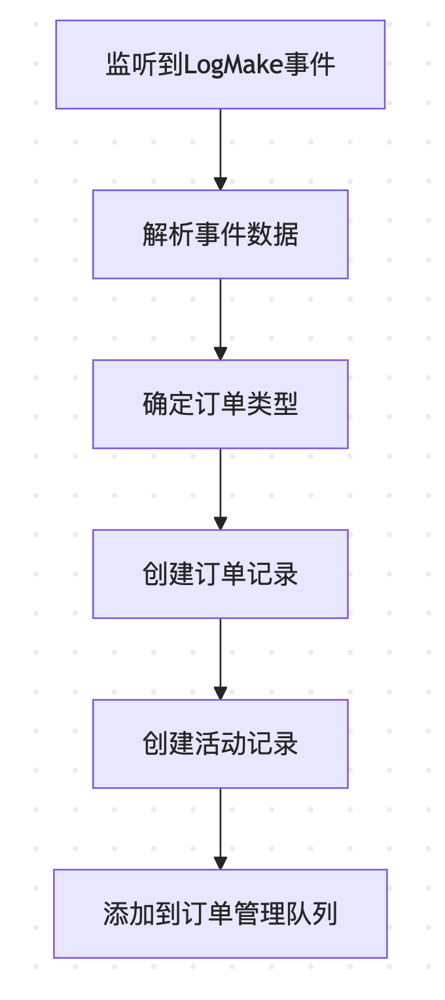

- [下单事件处理流程](#下单事件处理流程)
	- [处理流程图](#处理流程图)
	- [关键代码步骤](#关键代码步骤)
		- [1. 事件数据解析](#1-事件数据解析)
		- [2. 订单类型判断](#2-订单类型判断)
		- [3. 创建订单记录](#3-创建订单记录)
		- [4. 数据库写入](#4-数据库写入)
		- [5. 创建活动记录](#5-创建活动记录)
		- [6. 加入订单管理队列](#6-加入订单管理队列)
	- [关键特性](#关键特性)

# 下单事件处理流程
根据代码分析，下单事件(LogMake)的处理流程如下：

## 处理流程图


## 关键代码步骤

### 1. 事件数据解析
```go
// service.go:handleMakeEvent
var event struct {
    OrderKey [32]byte
    Nft      struct {
        TokenId        *big.Int
        CollectionAddr common.Address
        Amount         *big.Int
    }
    Price  *big.Int
    Expiry uint64
    Salt   uint64
}
err := s.parsedAbi.UnpackIntoInterface(&event, "LogMake", log.Data)
```

### 2. 订单类型判断
```go
side := uint8(new(big.Int).SetBytes(log.Topics[1].Bytes()).Uint64())
saleKind := uint8(new(big.Int).SetBytes(log.Topics[2].Bytes()).Uint64())
maker := common.BytesToAddress(log.Topics[3].Bytes())

var orderType int64
if side == Bid { // 买单
    if saleKind == FixForCollection {
        orderType = multi.CollectionBidOrder
    } else {
        orderType = multi.ItemBidOrder
    }
} else { // 卖单
    orderType = multi.ListingOrder
}
```

### 3. 创建订单记录
```go
newOrder := multi.Order{
    CollectionAddress: event.Nft.CollectionAddr.String(),
    MarketplaceId:     multi.MarketOrderBook,
    TokenId:           event.Nft.TokenId.String(),
    OrderID:           HexPrefix + hex.EncodeToString(event.OrderKey[:]),
    OrderStatus:       multi.OrderStatusActive,
    EventTime:         time.Now().Unix(),
    ExpireTime:        int64(event.Expiry),
    CurrencyAddress:   s.cfg.ContractCfg.EthAddress,
    Price:             decimal.NewFromBigInt(event.Price, 0),
    Maker:             maker.String(),
    Taker:             ZeroAddress,
    QuantityRemaining: event.Nft.Amount.Int64(),
    Size:              event.Nft.Amount.Int64(),
    OrderType:         orderType,
    Salt:              int64(event.Salt),
}
```

### 4. 数据库写入
```go
// 使用OnConflict防止重复插入
s.db.WithContext(s.ctx).Table(multi.OrderTableName(s.chain)).Clauses(clause.OnConflict{
    DoNothing: true,
}).Create(&newOrder)
```

### 5. 创建活动记录
```go
newActivity := multi.Activity{
    ActivityType:      activityType,
    Maker:             maker.String(),
    Taker:             ZeroAddress,
    MarketplaceID:     multi.MarketOrderBook,
    CollectionAddress: event.Nft.CollectionAddr.String(),
    TokenId:           event.Nft.TokenId.String(),
    CurrencyAddress:   s.cfg.ContractCfg.EthAddress,
    Price:             decimal.NewFromBigInt(event.Price, 0),
    BlockNumber:       int64(log.BlockNumber),
    TxHash:            log.TxHash.String(),
    EventTime:         int64(blockTime),
}
```

### 6. 加入订单管理队列
```go
s.orderManager.AddToOrderManagerQueue(&multi.Order{
    ExpireTime:        newOrder.ExpireTime,
    OrderID:           newOrder.OrderID,
    CollectionAddress: newOrder.CollectionAddress,
    TokenId:           newOrder.TokenId,
    Price:             newOrder.Price,
    Maker:             newOrder.Maker,
})
```

## 关键特性

1. **防重复插入**：使用GORM的`OnConflict`机制确保数据唯一性
2. **订单状态管理**：初始状态为`OrderStatusActive`
3. **活动追踪**：创建活动记录用于后续统计
4. **异步处理**：通过队列处理订单相关的后续操作

这个流程确保了订单数据的完整性和一致性，同时通过队列机制提高了系统的处理效率。