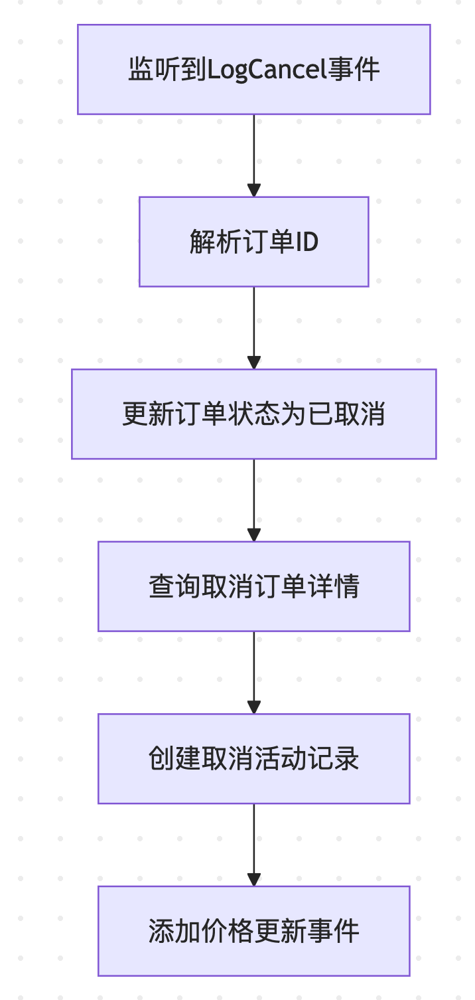

- [处理流程图](#处理流程图)
- [关键代码步骤](#关键代码步骤)
	- [1. 事件数据解析](#1-事件数据解析)
	- [2. 更新订单状态](#2-更新订单状态)
	- [3. 查询订单详情](#3-查询订单详情)
	- [4. 创建活动记录](#4-创建活动记录)
	- [5. 添加价格更新事件](#5-添加价格更新事件)
- [关键特性](#关键特性)


根据代码分析，取消订单事件(LogCancel)的处理流程如下：

## 处理流程图


## 关键代码步骤

### 1. 事件数据解析
```go
// service.go:handleCancelEvent
orderId := HexPrefix + hex.EncodeToString(log.Topics[1].Bytes())
```

### 2. 更新订单状态
```go
// service.go:handleCancelEvent
if err := s.db.WithContext(s.ctx).Table(multi.OrderTableName(s.chain)).
    Where("order_id = ?", orderId).
    Update("order_status", multi.OrderStatusCancelled).Error; err != nil {
    xzap.WithContext(s.ctx).Error("failed on update order status",
        zap.String("order_id", orderId))
    return
}
```

### 3. 查询订单详情
```go
// service.go:handleCancelEvent
var cancelOrder multi.Order
if err := s.db.WithContext(s.ctx).Table(multi.OrderTableName(s.chain)).
    Where("order_id = ?", orderId).
    First(&cancelOrder).Error; err != nil {
    xzap.WithContext(s.ctx).Error("failed on get cancel order",
        zap.Error(err))
    return
}
```

### 4. 创建活动记录
```go
// service.go:handleCancelEvent
var activityType int
if cancelOrder.OrderType == multi.ListingOrder {
    activityType = multi.CancelListing
} else if cancelOrder.OrderType == multi.CollectionBidOrder {
    activityType = multi.CancelCollectionBid
} else {
    activityType = multi.CancelItemBid
}

newActivity := multi.Activity{
    ActivityType:      activityType,
    Maker:             cancelOrder.Maker,
    Taker:             ZeroAddress,
    MarketplaceID:     multi.MarketOrderBook,
    CollectionAddress: cancelOrder.CollectionAddress,
    TokenId:           cancelOrder.TokenId,
    CurrencyAddress:   s.cfg.ContractCfg.EthAddress,
    Price:             cancelOrder.Price,
    BlockNumber:       int64(log.BlockNumber),
    TxHash:            log.TxHash.String(),
    EventTime:         int64(blockTime),
}
```

### 5. 添加价格更新事件
```go
// service.go:handleCancelEvent
if err := ordermanager.AddUpdatePriceEvent(s.kv, &ordermanager.TradeEvent{
    OrderId:        cancelOrder.OrderID,
    CollectionAddr: cancelOrder.CollectionAddress,
    TokenID:        cancelOrder.TokenId,
    EventType:      ordermanager.Cancel,
}, s.chain); err != nil {
    xzap.WithContext(s.ctx).Error("failed on add update price event",
        zap.Error(err),
        zap.String("type", "cancel"),
        zap.String("order_id", cancelOrder.OrderID))
}
```

## 关键特性

1. **状态更新**：将订单状态更新为`OrderStatusCancelled`
2. **活动记录**：根据订单类型创建相应的取消活动记录
3. **价格影响**：通过价格更新队列处理取消订单对价格的影响
4. **错误处理**：每个步骤都有相应的错误处理逻辑
5. **数据一致性**：使用事务确保数据的一致性

这个流程确保了取消订单事件的完整处理，包括状态更新、活动记录和价格影响的处理。