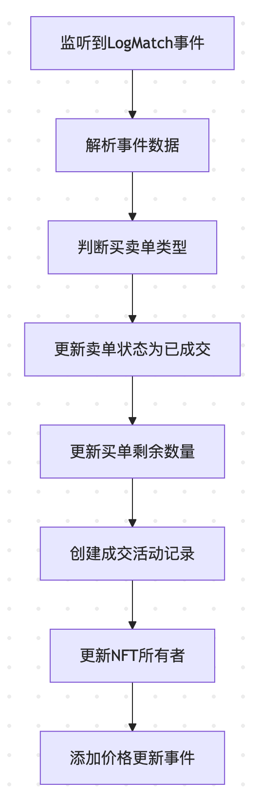

- [主流程分析](#主流程分析)
	- [处理流程图](#处理流程图)
	- [关键代码步骤](#关键代码步骤)
		- [1. 事件数据解析](#1-事件数据解析)
		- [2. 判断买卖单类型](#2-判断买卖单类型)
		- [3. 更新卖单状态](#3-更新卖单状态)
		- [4. 更新买单剩余数量](#4-更新买单剩余数量)
		- [5. 创建成交活动记录](#5-创建成交活动记录)
		- [6. 更新NFT所有者](#6-更新nft所有者)
		- [7. 添加价格更新事件](#7-添加价格更新事件)
	- [关键特性](#关键特性)
- [关键字段含义](#关键字段含义)
	- [核心字段说明](#核心字段说明)
		- [订单ID相关](#订单id相关)
		- [NFT信息相关](#nft信息相关)
		- [交易双方信息](#交易双方信息)
		- [订单管理相关](#订单管理相关)
	- [字段使用场景](#字段使用场景)
- [quantity\_remaqining设为0的原因?](#quantity_remaqining设为0的原因)
	- [核心原因](#核心原因)
		- [1. **订单类型决定**：](#1-订单类型决定)
		- [2. **代码中的逻辑体现**：](#2-代码中的逻辑体现)
		- [3. **成交时的处理**：](#3-成交时的处理)
	- [特殊情况说明](#特殊情况说明)
		- [1. **ERC1155的情况**：](#1-erc1155的情况)
		- [2. **买单的特殊处理**：](#2-买单的特殊处理)
	- [设计理念](#设计理念)
- [买单部分成交是什么意思，实例说明?](#买单部分成交是什么意思实例说明)
	- [实例场景](#实例场景)
	- [部分成交过程](#部分成交过程)
	- [代码中的处理逻辑](#代码中的处理逻辑)
	- [关键点](#关键点)
- [买单还是卖单，是针对NFT来说的么？买单就是买NFT的，卖单就是卖NFT的?](#买单还是卖单是针对nft来说的么买单就是买nft的卖单就是卖nft的)
	- [订单类型定义](#订单类型定义)
	- [具体说明](#具体说明)
	- [成交逻辑](#成交逻辑)

# 主流程分析
根据代码分析，撮合订单事件(LogMatch)的处理流程如下：

## 处理流程图


## 关键代码步骤

### 1. 事件数据解析
```go
// service.go:handleMatchEvent
var event struct {
    MakeOrder Order
    TakeOrder Order
    FillPrice *big.Int
}
err := s.parsedAbi.UnpackIntoInterface(&event, "LogMatch", log.Data)
makeOrderId := HexPrefix + hex.EncodeToString(log.Topics[1].Bytes())
takeOrderId := HexPrefix + hex.EncodeToString(log.Topics[2].Bytes())
```

### 2. 判断买卖单类型
```go
if event.MakeOrder.Side == Bid { // 买单，由卖方发起交易撮合
    owner = strings.ToLower(event.MakeOrder.Maker.String())
    collection = event.TakeOrder.Nft.CollectionAddr.String()
    tokenId = event.TakeOrder.Nft.TokenId.String()
    from = event.TakeOrder.Maker.String()
    to = event.MakeOrder.Maker.String()
    sellOrderId = takeOrderId
```

### 3. 更新卖单状态
```go
if err := s.db.WithContext(s.ctx).Table(multi.OrderTableName(s.chain)).
    Where("order_id = ?", takeOrderId).
    Updates(map[string]interface{}{
        "order_status":       multi.OrderStatusFilled,
        "quantity_remaining": 0,
        "taker":              to,
    }).Error; err != nil {
    xzap.WithContext(s.ctx).Error("failed on update order status",
        zap.String("order_id", takeOrderId))
    return
}
```

### 4. 更新买单剩余数量
```go
if buyOrder.QuantityRemaining > 1 {
    if err := s.db.WithContext(s.ctx).Table(multi.OrderTableName(s.chain)).
        Where("order_id = ?", makeOrderId).
        Update("quantity_remaining", buyOrder.QuantityRemaining-1).Error; err != nil {
        xzap.WithContext(s.ctx).Error("failed on update order quantity_remaining",
            zap.String("order_id", makeOrderId))
        return
    }
} else {
    if err := s.db.WithContext(s.ctx).Table(multi.OrderTableName(s.chain)).
        Where("order_id = ?", makeOrderId).
        Updates(map[string]interface{}{
            "order_status":       multi.OrderStatusFilled,
            "quantity_remaining": 0,
        }).Error; err != nil {
        xzap.WithContext(s.ctx).Error("failed on update order status",
            zap.String("order_id", makeOrderId))
        return
    }
}
```

### 5. 创建成交活动记录
```go
newActivity := multi.Activity{
    ActivityType:      multi.Sale,
    Maker:             event.MakeOrder.Maker.String(),
    Taker:             event.TakeOrder.Maker.String(),
    MarketplaceID:     multi.MarketOrderBook,
    CollectionAddress: collection,
    TokenId:           tokenId,
    CurrencyAddress:   s.cfg.ContractCfg.EthAddress,
    Price:             decimal.NewFromBigInt(event.FillPrice, 0),
    BlockNumber:       int64(log.BlockNumber),
    TxHash:            log.TxHash.String(),
    EventTime:         int64(blockTime),
}
```

### 6. 更新NFT所有者
```go
if err := s.db.WithContext(s.ctx).Table(multi.ItemTableName(s.chain)).
    Where("collection_address = ? and token_id = ?", strings.ToLower(collection), tokenId).
    Update("owner", owner).Error; err != nil {
    xzap.WithContext(s.ctx).Error("failed to update item owner",
        zap.Error(err))
    return
}
```

### 7. 添加价格更新事件
```go
if err := ordermanager.AddUpdatePriceEvent(s.kv, &ordermanager.TradeEvent{
    OrderId:        sellOrderId,
    CollectionAddr: collection,
    EventType:      ordermanager.Buy,
    TokenID:        tokenId,
    From:           from,
    To:             to,
}, s.chain); err != nil {
    xzap.WithContext(s.ctx).Error("failed on add update price event",
        zap.Error(err),
        zap.String("type", "sale"),
        zap.String("order_id", sellOrderId))
}
```

## 关键特性

1. **订单状态管理**：区分买单和卖单，分别处理状态更新
2. **数量控制**：处理部分成交的情况，更新剩余数量
3. **活动记录**：记录完整的交易信息
4. **所有权转移**：更新NFT的所有者信息
5. **价格影响**：通过价格更新队列处理成交对价格的影响
6. **事务完整性**：确保所有相关数据的原子性更新

这个流程确保了撮合订单事件的完整处理，包括订单状态更新、活动记录、所有权转移和价格影响的处理。

# 关键字段含义


这些字段是在处理撮合订单事件(LogMatch)时使用的，让我详细解释每个字段的含义：

## 核心字段说明

### 订单ID相关
```go
makeOrderId := HexPrefix + hex.EncodeToString(log.Topics[1].Bytes())
takeOrderId := HexPrefix + hex.EncodeToString(log.Topics[2].Bytes())
```
- `makeOrderId`: 原始订单ID，从事件日志的第一个topic中解析得到
- `takeOrderId`: 接单订单ID，从事件日志的第二个topic中解析得到

### NFT信息相关
```go
var owner string // NFT归属者
var collection string
var tokenId string
```
- `owner`: NFT交易后的新所有者地址
- `collection`: NFT所属的集合合约地址
- `tokenId`: 被交易的NFT的唯一标识符

### 交易双方信息
```go
var from string
var to string
```
- `from`: NFT转出方地址（卖方）
- `to`: NFT接收方地址（买方）

### 订单管理相关
```go
var sellOrderId string // 卖方订单ID
var buyOrder multi.Order
```
- `sellOrderId`: 卖方订单的唯一标识符，用于后续价格更新
- `buyOrder`: 买单的详细信息结构体，包含订单状态、数量等信息

## 字段使用场景

1. **订单匹配**：通过makeOrderId和takeOrderId识别匹配的两个订单
2. **所有权转移**：使用owner、from、to字段更新NFT的所有者
3. **活动记录**：记录完整的交易信息到活动表
4. **价格影响**：通过sellOrderId更新集合的地板价
5. **状态更新**：通过buyOrder更新买单的剩余数量

这些字段共同构成了撮合订单事件的完整处理流程，确保了交易的准确记录和状态更新。


# quantity_remaqining设为0的原因?

```go
// 更新卖方订单状态
		if err := s.db.WithContext(s.ctx).Table(multi.OrderTableName(s.chain)).
			Where("order_id = ?", takeOrderId).
			Updates(map[string]interface{}{
				"order_status":       multi.OrderStatusFilled,
				"quantity_remaining": 0,
				"taker":              to,
			}).Error; err != nil {
			xzap.WithContext(s.ctx).Error("failed on update order status",
				zap.String("order_id", takeOrderId))
			return
		}
```

这个问题的答案在于订单撮合的特性。让我详细解释：

## 核心原因

### 1. **订单类型决定**：
   - 在NFT交易中，每个订单都是针对特定NFT的
   - ERC721标准的NFT，每个Token ID都是唯一的
   - 因此一个订单只能成交一次

### 2. **代码中的逻辑体现**：
```go
// 在handleMakeEvent中创建订单时
QuantityRemaining: event.Nft.Amount.Int64(), // 初始数量
Size:              event.Nft.Amount.Int64(), // 订单总数量
```

### 3. **成交时的处理**：
```go
// 在handleMatchEvent中更新订单状态
Updates(map[string]interface{}{
    "order_status":       multi.OrderStatusFilled,
    "quantity_remaining": 0,  // 直接设为0，因为NFT只能成交一次
    "taker":              to,
})
```

## 特殊情况说明

### 1. **ERC1155的情况**：
   - 虽然ERC1155支持批量NFT
   - 但在EasySwap中，每个订单仍然只处理单个NFT
   - 这是为了简化交易逻辑和风险控制

### 2. **买单的特殊处理**：
```go
if buyOrder.QuantityRemaining > 1 {
    // 只有买单才可能部分成交
    Update("quantity_remaining", buyOrder.QuantityRemaining-1)
} else {
    // 卖单总是完全成交
    Updates(map[string]interface{}{
        "quantity_remaining": 0
    })
}
```

## 设计理念

这种设计确保了：
1. 交易原子性：要么完全成交，要么不成交
2. 简化逻辑：避免部分成交带来的复杂性
3. 风险控制：防止订单状态混乱

所以，quantity_remaining设为0是因为NFT的唯一性决定了每个订单只能完全成交一次。


# 买单部分成交是什么意思，实例说明?


买单部分成交是指一个买单可以购买多个NFT的情况。让我通过实例来说明：

## 实例场景

假设用户A想购买一个NFT集合中的任意3个NFT，他创建了一个买单：

```go
// 创建买单时
newOrder := multi.Order{
    QuantityRemaining: 3,  // 初始数量为3
    Size:              3,  // 订单总数量为3
    OrderType:         multi.CollectionBidOrder, // 集合买单类型
    Price:             decimal.NewFromFloat(0.1), // 单价0.1 ETH
}
```

## 部分成交过程

1. **第一次成交**：
   - 用户B出售了一个NFT
   - 系统更新订单：
   ```go
   Updates(map[string]interface{}{
       "quantity_remaining": 2,  // 剩余可购买数量减1
   })
   ```

2. **第二次成交**：
   - 用户C出售了一个NFT
   - 系统更新订单：
   ```go
   Updates(map[string]interface{}{
       "quantity_remaining": 1,  // 剩余可购买数量再减1
   })
   ```

3. **第三次成交**：
   - 用户D出售了一个NFT
   - 系统更新订单：
   ```go
   Updates(map[string]interface{}{
       "order_status":       multi.OrderStatusFilled,  // 订单完全成交
       "quantity_remaining": 0,  // 剩余数量为0
   })
   ```

## 代码中的处理逻辑

在`handleMatchEvent`函数中可以看到：

```go
if buyOrder.QuantityRemaining > 1 {
    // 部分成交：只减少剩余数量
    Update("quantity_remaining", buyOrder.QuantityRemaining-1)
} else {
    // 完全成交：更新状态和剩余数量
    Updates(map[string]interface{}{
        "order_status":       multi.OrderStatusFilled,
        "quantity_remaining": 0,
    })
}
```

## 关键点

1. **适用场景**：
   - CollectionBidOrder（集合买单）
   - 可以购买集合中任意可用的NFT
   - 直到达到预设数量才完全成交

2. **与卖单的区别**：
   - 卖单（ListingOrder）总是完全成交
   - 因为每个NFT都是独一无二的
   - 买单可以部分成交，因为可以购买多个NFT

这种设计使得用户可以一次性创建一个购买多个NFT的订单，而不需要为每个NFT单独创建订单。

# 买单还是卖单，是针对NFT来说的么？买单就是买NFT的，卖单就是卖NFT的?


> 是的，你的理解完全正确。

让我通过代码来详细解释：

## 订单类型定义

在`handleMakeEvent`函数中可以看到订单类型的判断逻辑：

```go
if side == Bid { // 买单
    if saleKind == FixForCollection { 
        orderType = multi.CollectionBidOrder // 集合买单
    } else { 
        orderType = multi.ItemBidOrder // 单品买单
    }
} else { // 卖单
    orderType = multi.ListingOrder // 挂单
}
```

## 具体说明

1. **买单（Bid）**：
   - `CollectionBidOrder`：想买一个NFT集合中的任意NFT
   - `ItemBidOrder`：想买某个特定的NFT
   - 本质都是"买NFT"的订单

2. **卖单（Listing）**：
   - `ListingOrder`：出售NFT的订单
   - 本质是"卖NFT"的订单

## 成交逻辑

在`handleMatchEvent`函数中的撮合逻辑也印证了这一点：

```go
if event.MakeOrder.Side == Bid { // 如果是买单
	// MakeOrder是买方，那么TakeOrder就是卖NFT的方
    owner = strings.ToLower(event.MakeOrder.Maker.String()) // NFT最终归属买单方
    to = event.MakeOrder.Maker.String() // NFT转给买单方
} else { // 如果是卖单
	// MakeOrder是卖方(卖NFT的)，那么TakeOrder就是买NFT的方
    owner = strings.ToLower(event.TakeOrder.Maker.String()) // NFT最终归属买单方
    to = event.TakeOrder.Maker.String() // NFT转给买单方
}
```

所以，你的理解完全正确：
- 买单 = 买NFT的订单
- 卖单 = 卖NFT的订单

这个命名方式很直观，就是从NFT的角度来命名的。