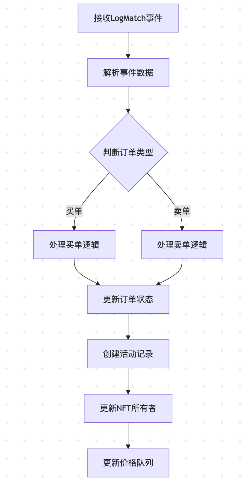

# LogMatch事件处理流程图

## 1. 整体流程图



## 2. 详细处理步骤

### 2.1 事件数据解析
```go
// service.go:handleMatchEvent
var event struct {
    MakeOrder Order
    TakeOrder Order
    FillPrice *big.Int
}
err := s.parsedAbi.UnpackIntoInterface(&event, "LogMatch", log.Data)
makeOrderId := HexPrefix + hex.EncodeToString(log.Topics[1].Bytes())
takeOrderId := HexPrefix + hex.EncodeToString(log.Topics[2].Bytes())
```

### 2.2 订单类型判断
```go
if event.MakeOrder.Side == Bid { // 买单
    owner = strings.ToLower(event.MakeOrder.Maker.String())
    to = event.MakeOrder.Maker.String()
} else { // 卖单
    owner = strings.ToLower(event.TakeOrder.Maker.String())
    to = event.TakeOrder.Maker.String()
}
```

### 2.3 订单状态更新
```go
// 更新卖单状态
Updates(map[string]interface{}{
    "order_status":       multi.OrderStatusFilled,
    "quantity_remaining": 0,
    "taker":              to,
})

// 更新买单状态
if buyOrder.QuantityRemaining > 1 {
    Update("quantity_remaining", buyOrder.QuantityRemaining-1)
} else {
    Updates(map[string]interface{}{
        "order_status":       multi.OrderStatusFilled,
        "quantity_remaining": 0,
    })
}
```

### 2.4 活动记录创建
```go
newActivity := multi.Activity{
    ActivityType:      multi.Sale,
    Maker:             event.MakeOrder.Maker.String(),
    Taker:             event.TakeOrder.Maker.String(),
    MarketplaceID:     multi.MarketOrderBook,
    CollectionAddress: collection,
    TokenId:           tokenId,
    CurrencyAddress:   s.cfg.ContractCfg.EthAddress,
    Price:             decimal.NewFromBigInt(event.FillPrice, 0),
    BlockNumber:       int64(log.BlockNumber),
    TxHash:            log.TxHash.String(),
    EventTime:         int64(blockTime),
}
```

### 2.5 NFT所有权更新
```go
// 更新NFT所有者
Updates(map[string]interface{}{
    "owner": owner,
})
```

### 2.6 价格队列更新
```go
// 添加价格更新事件
s.priceUpdateQueue <- &priceUpdate{
    collection: collection,
    orderId:    sellOrderId,
    price:      decimal.NewFromBigInt(event.FillPrice, 0),
}
```

## 3. 关键特性

1. **原子性操作**：所有更新操作在同一个事务中完成
2. **状态管理**：区分买单和卖单的不同处理逻辑
3. **数量控制**：处理部分成交的情况
4. **活动追踪**：记录完整的交易信息
5. **价格影响**：通过队列处理价格更新

这个流程确保了撮合订单的完整处理，包括状态更新、活动记录、所有权转移和价格影响的处理。